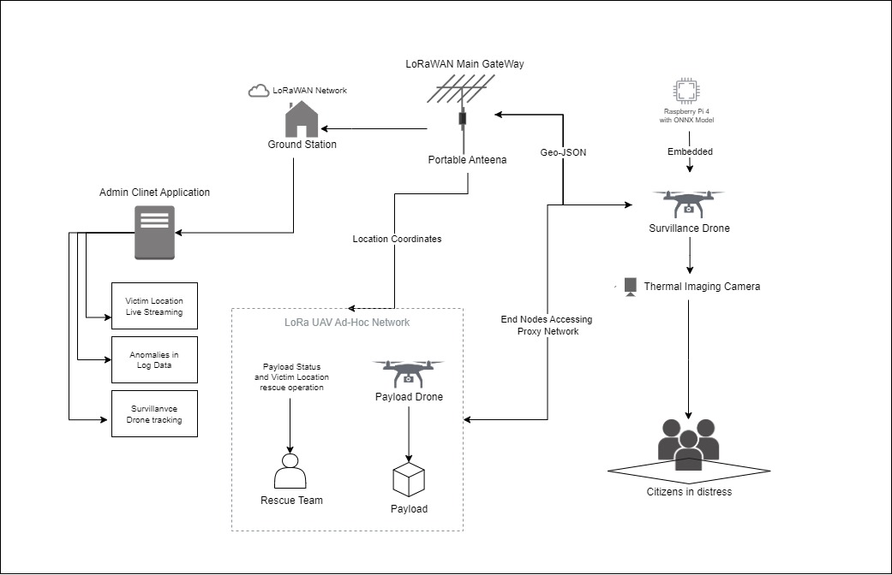

# DROPEX
Disaster Rescue Operations and Probing using EXpert Drones is Disaster Risk Management (DRM) framework which is utilised to use swarm of drones with autonomous person detection and payload dropping making the rescue operations optimal.

## Architecture


## Implementation
As seen in the architecture, the Object Detection model using YoLoV8 and META-DeTr on two different datasets. The model are converted to ONNX format which is sutiable to be run upon embedded systems like Raspberry Pi 4.

These models are deployed using a FastAPI server with streamlit user interface for simulation purposes. The simulation is majorly supported using a WEBGL based app created using Unity Engine and the source code can be found here: 
[DROPEX-simulation](https://github.com/kausthub-kannan/DROPEX-simulation).

## Running simulation locally:
**Note:** The setup.py has be run at the parent directory of the project. This would also install the required DETR models 
from hugging face. If you prefer to use your own models, you can replace the models in the `simulation/models` directory.
The DETR model can be found at Hugging Face: [DETR](https://huggingface.co/kausthubkannan17/dropex).
```bash
cd simulation
python setup.py
```

#### Run FastAPI server (also servers the WEBGL app)
```bash
cd server
uvicorn main:app --reload
```
#### Run Streamlit server
```bash
cd client
streamlit run main.py
```


